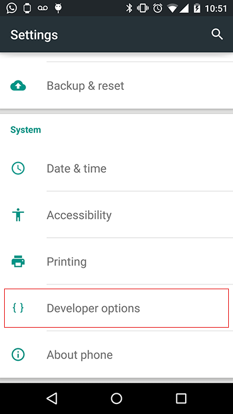
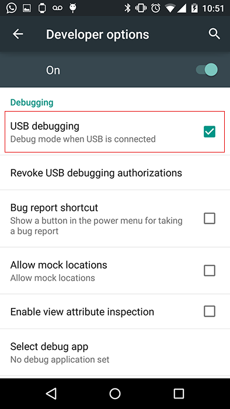
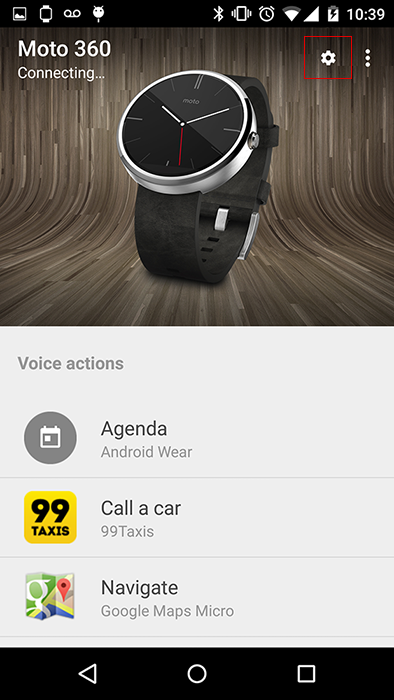

## Bluetooth debugging no Android Wear


Vamos ver os passos para poder conectar um [Moto360](https://moto360.motorola.com/) no seu computador para podre desenolver aplicações.


## Ligar o Debugging over Bluetooth no Android Wear
Vá no seu **Android Wear** e clique em  **Settings** > **Developer Options** e habilite as opções **ADB Debugging** e **Debug Over Bluetooth**.


## Conecte e habilte o USB Debugging no seu Celular Android
Conecte seu celular com o cabo USB ao computador a vá em **Android Mobile** > **Developer Options** e habilte a opção **USB Debugging**.






## Habilite o Debugging over Bluetooth no Celular Android

Abra o aplicativo **Android Wear App**, vá em **Settings** e habilete a opção **Debugging Over Bluetooth**.




## Conecte o ADB ao seu Android Wear

  1. Abra o aplicativo **Terminal**

  2. Verifique que seu Celular esta conectado usando o comando:
  ```
  $ adb devices
  ```

  3. Agora conecte seu Android Wear (no meu caso o Moto 360) usando os comandos:
  ```
  $ adb forward tcp:4444 localabstract:/adb-hub
  $ adb connect localhost:4444
  ```

  4. Verifique que seu Adnroid Wear está conectado. Abra o aplicativo **Android Wear App** e ele deve mostrar que o estatus esta conectado para o **Host** e para o **Target**.

  

  5. Outra forma é rodando o comando **adb devices** novamente e deve aparecer o device **localhost:4444** que é o seu Android Wear.


## BONUS TIME
Vamos ver com otirar print-screens do nosso Android Wear device.

### Tirar um print-screen
```
$ adb -s localhost:4444 shell screencap -p /sdcard/DCIM/screen.png
```

### Mover o print-screen para o seu computador
```
$ adb -s localhost:4444 pull /sdcard/DCIM/
```

### Apagar o print-screen que está no seu Android Wear Device
```
$ adb -s localhost:4444 shell rm /sdcard/DCIM/screen.png
```

Pronto agora você já pode começar a cirar sua aplicação para o Android Wear!
