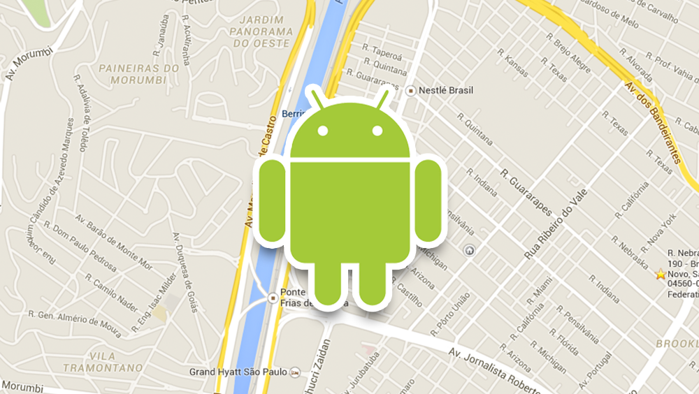

## Adicionando Google Maps V2 em um projeto Android


Vamos ver como inserir o [Google Maps V2](https://developers.google.com/maps/documentation/android/) em um projeto Android.

## Adicionando as permissões no **AndroidManifest**

Antes de mais nada vamos adicioanr as permissões nescessárias **[<uses-permission>](https://developer.android.com/guide/topics/manifest/uses-permission-element.html) ao nosso arquivo **AndroidManifest.xml** dentro da tag [<manifest>](https://developer.android.com/guide/topics/manifest/manifest-element.html)

```
    <uses-permission android:name="android.permission.INTERNET"/>
    <uses-permission android:name="android.permission.ACCESS_NETWORK_STATE"/>
    <uses-permission android:name="android.permission.WRITE_EXTERNAL_STORAGE"/>
    <!-- Esses dois não são obrigatórios para a V2 do Google Maps mais são recomendados -->
    <uses-permission android:name="android.permission.ACCESS_COARSE_LOCATION"/>
    <uses-permission android:name="android.permission.ACCESS_FINE_LOCATION"/>
```

## Adicionar o Google Play service no seu aplicativo dentro da tag **<application>**

```
<meta-data
    android:name="com.google.android.gms.version"
    android:value="@integer/google_play_services_version" />
```

## Vamos criar um certificado para utilizar a API do Google Maps V2

  1. Entre no [Google Developer Console](https://console.developers.google.com)

  2. Dentro do seu projeto clique em **APIs** no menu esquerdo e habilite o **Google Maps Android API v2**

  

  3. Pegue o certificado **SHA1** de desenvolvimento para gerar sua API Key

  Digite no terminal:
  ```
  $ keytool -list -v -keystore ~/.android/debug.keystore -alias androiddebugkey -storepass android -keypass android
  ```

  4. Agora no menu esquerdo vá em **Credentials** e crie uma nova chave de API para Android

  

  5. No popup insira a chanve **SHA1** junto do nome do seu aplicativo separados por um **;** (ponto e virgula)

  

  6. Adicione a **API Key** no **AndoirManifest**

  ```
  <meta-data
      android:name="com.google.android.maps.v2.API_KEY"
      android:value="COLOQUE_AQUI_SUA_API_KEY"/>
  ```

## Adicione o mapa na sua activity

```
<fragment xmlns:android="http://schemas.android.com/apk/res/android"
    android:id="@+id/map"
    android:layout_width="match_parent"
    android:layout_height="match_parent"
    android:name="com.google.android.gms.maps.MapFragment"/>
```

Pronto agora já é só compilar o projeto e temos nosso mapa na Activity principal.


